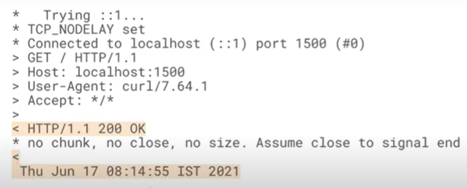

# 1.7 Simple web server

Created: September 22, 2024 3:46 PM
Class: Modern App Developement 1
Week: Week 1

# Simplest Web Server

```bash
while true; do
	echo -e "HTTP/1.1 200 OK\n\n $(date)" |
		nc -l localhost 1500;
done
```

The second line starts with echo. Echo is a shell command that prints out whatever is inside quotes, basically print().

echo outputs commands in the standard output (std out).

The pipe symbol is NOT or, it redirects (pipes) the output of the first line into the second line. 
That way the text inside quotes is redirected to the next line.

Inside the quotes, it says “200 OK”, 200 is an HTTP status code that is used when everything is okay (like 404 is page not found).

Moving on to the second command it starts with “nc” (netcat).
Netcat is fed the echo statement. Then whenever a request is sent to port 1500 NC just sends whatever it received.

We need to send a request to port 1500 in order to see if it’s working using the curl command.

### Uniform Resource Locator

A URL is just the request type separated by the address with a ://

In out case it’s http://localhost:1500

### General Web Server

A normal web server listens for requests on a particular port. As soon as it gets one, it runs some code then returns the output.

# Simple Web Server (log??)



Everything starting with * is debug information, nothing actually sent or recieved. Things starting with > is what was sent from the client to the server, < is the exact opposite of that.

Line 1: The server is trying to connect to ::1. This just means the local machine and is an IPv6 address.

Line 3: Confirms connection

Line 4: Header information automatically sent by curl.

Line 6: User agent means exactly what it sounds like, if you were using chrome for instance it would say something like chrome.

Line 7: Says what type of data the client is willing to accept. In this case “*/*” means anything is fine.

Line 8: Empty on purpose, it being empty means that the client is now done.

Everything after line 8 is whatever was sent from the server in the echo statement.