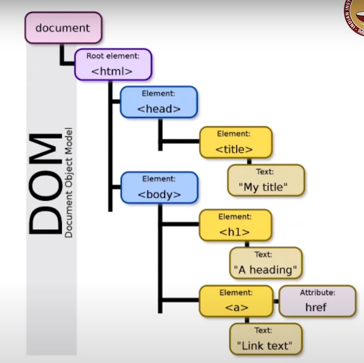

# 2.4 Intro to HTML

Created: October 1, 2024 2:05 AM
Class: Modern App Developement 1
Week: Week 2

# Hyper Text Markup Language

HTML was first used at CERN by Tim Berners Lee (same guy who made the web). It was an application of SGML (standard generalized markup language). It is meant for browser interpretation.

SGML was very rigid and had a very specific structure. HTML was more forgiving with less strict validity checks.

## Tags

Tags are keywords in HTML that carry a speceific meaning. They are denoted by some text inside angular brackets (<>).

For example, <html>, <head>, <body>, etc.

Most tags (not all) need to be closed by placing a forward slash after the first angular bracket, like 
, </head>, etc.

Tags are also case insensitive.

Tags can be nested. If tag2 is inside tag1 for example, tag2 needs to be closed before tag1.

For example

✅ 
<h1> Hello World </h1> 

❌ 
<h1> Hello World 
<h1>

# Document Object Model

The structure of an HTML file can be interpreted as a tree. There are ways to directly modify an element via code, often javascript.

